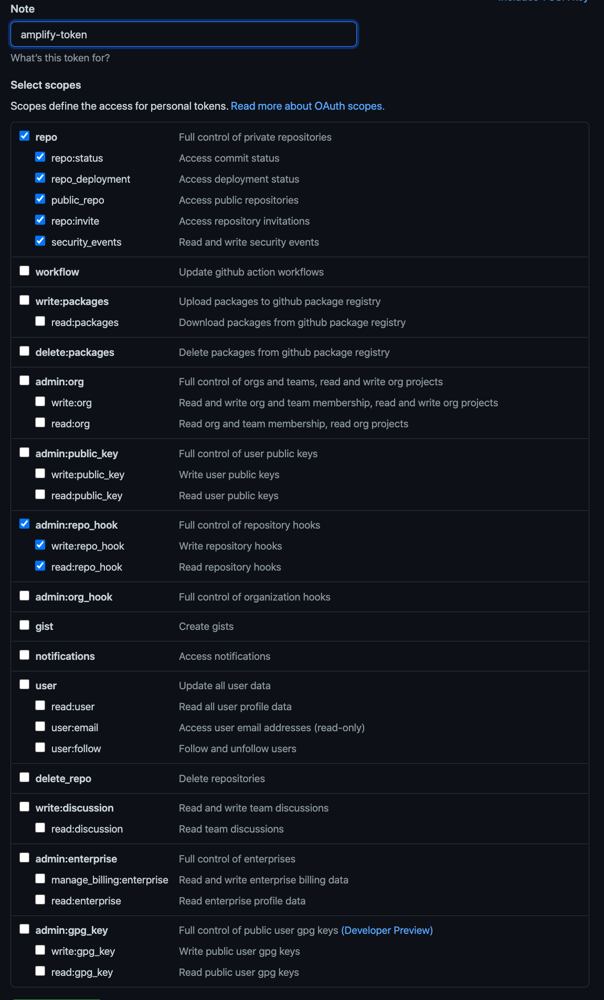

안녕 AWS Amplify?

안녕하세요, 김재욱입니다. 오늘의 주제는 Hosting Jekyll Site with AWS Amplify ([AWS Amplify - 앰플리파이](https://aws.amazon.com/amplify/?nc=sn&loc=0) 로 [Jekyll - 지킬](https://jekyllrb.com/) 호스팅) 하기 입니다.

> 본 글은 "나는 적어도 CLI로 클라우드에서 리소스 만져봤다" 하시는 분들을 위주로 작성 되었습니다.

현재 읽고 계신 이 블로그는 지킬을 베이스로 만들어진 정적 사이트 (Static site)이며 깃헙페이지에 호스팅이 되어 있는데요, 오늘의 글에서 이 블로그를 AWS Amplify에 호스팅을 해보도록 하겠습니다.

시작 전 필수적으로 필요한게 있습니다, 없을시 만들어 주세요.
- AWS CLI 설정
- 깃헙 계정 및 지킬코드베이스
  - Amplify가 리포지토리 엑세스할 수 있도록 OAuthToken이 필요합니다.

이번 글에선, **과금**이 되는 리소스가 만들어지니, 따라하기 완료 후 삭제를 원하실경우 삭제하시고, 필요할때 다시 같은 템플렛을 사용하여 만드실수 있습니다.

---

### Github OAuth Token 만들기
Github OAuthToken이 배포과정에서 필요로 하게 됩니다.

Amplify가 만들어지면서 깃헙에 Deploy Key를 만들어, 배포에 필요권한들을 상속받아 사용되게 됩니다. 이 Deploy Key를 만들기 위해, Personal Access Token (개인 사용자 토큰)이 필요하게 됩니다.

[Personal Access Token](https://github.com/settings/tokens)을 만드는 방법은, Github 로그인 후 [링크 클릭](https://github.com/settings/tokens) 또는 오른쪽 상단 아이콘을 눌러, Settings로 들어간후, 왼쪽 패널의 Developer settings로 들어간뒤 Personal Access Token 메뉴를 누르시면 됩니다. 접속 후 Generate New Token 을 누른 뒤, Note 적어주시고 밑 이미지처럼 권한부여를 해주시면 됩니다.

> 만들어진 키는 **한번** 밖에 보여지지 않으니, 잘 적어 두시길 바랍니다! 혹시 못 적으셨으면, 방금 만든 키를 삭제 후 다시 만들어 주시길 바랍니다.

{: width="100%" height="100%"}
{: width="100%" height="100%"}

---

### AWS 리소스 배포

예시로 적힌 아래의 yaml파일을 복사하여 로컬에 `amplify_infra.yaml`로 저장후, CLI로 배포를 해보겠습니다.
배포의 전 과정은, CLI 또는 [AWS Console](https://console.aws.amazon.com/cloudformation/home)에서 확인 하실수 있습니다.

해당 [클라우드포메이션](https://docs.aws.amazon.com/AWSCloudFormation/latest/UserGuide/AWS_Amplify.html)으로 만들어지는 3가지 리소스는:
- IAM Role (과금없음)
  - 해당 롤은 Amplify앱에 연결 시켜줄 서비스Role입니다.
- Amplify App (과금)
  - Amplify 설정정보들이 담겨져 있습니다. 자세한 사항은 클라우드포메이션 다큐먼트를 참조 부탁드립니다.
  - BuildSpec 부분이 Amplify가 사용하는 코드 빌드 순서입니다.
    - 프리빌드 과정 : Gemfile에 나열된 디펜던시 설치
    - 빌드 과정    : 지킬 코드 빌드
    - 아티팩트 과정 : 빌드후 파일 이동경로
    - 캐쉬 과정    : 프리빌드 및 빌드과정 캐쉬저장 (빌드시간을 줄여줌으로, 과금 되는 시간을 줄여줍니다)
- Amplify Branch (과금없음)
  - 깃헙에서 불러올 브랜치 설정입니다. 꼭 마스터브랜치일 필요는 없으며, 멀티 브랜치 설정도 가능합니다.

```bash
## Cloudformation 만들기
## 약 3-5분
aws cloudformation deploy --stack-name deploy  \
--template-file ./amplify_infra.yaml \
--capabilities CAPABILITY_NAMED_IAM \
--parameter-overrides GithubOAuthToken=깃헙토큰 GithubURL=깃헙주소
```

{: width="100%" height="100%"}

```yaml
# 필수 yaml 파일. amplify_infra.yaml로 저장해주세요
AWSTemplateFormatVersion: 2010-09-09

Parameters:
  GithubOAuthToken:
    Type: String
    Description: Provide Github OAuth Token
    NoEcho: true
  GithubURL:
    Type: String
    Description: Provide Github URL

Resources:
  AmplifyRole:
      Type: AWS::IAM::Role
      Properties:
      AssumeRolePolicyDocument:
          Version: 2012-10-17
          Statement:
          - Effect: Allow
              Principal:
              Service:
                  - amplify.amazonaws.com
              Action:
              - sts:AssumeRole
      Policies:
          - PolicyName: Amplify
          PolicyDocument:
              Version: 2012-10-17
              Statement:
              - Effect: Allow
                  Action: "amplify:*"
                  Resource: "*"
  AmplifyApp:
      Type: "AWS::Amplify::App"
      Properties:
      Name: Blog
      Repository: !REF GithubURL
      AccessToken: !REF GithubOAuthToken
      BuildSpec: |-
          version: 0.1
          frontend:
          phases:
              preBuild:
              commands:
                  - bundle install --path vendor/bundle
              build:
              commands:
                  - JEKYLL_ENV=production bundle exec jekyll build
          artifacts:
              baseDirectory: _site
              files:
              - '**/*'
          cache:
              paths:
              - 'vendor/**/*'
      Tags: # 태그 업데이트
          - Key: Name
          Value: Jekyll
      IAMServiceRole: !GetAtt AmplifyRole.Arn
  AmplifyBranch:
      Type: AWS::Amplify::Branch
      Properties:
      BranchName: master
      AppId: !GetAtt AmplifyApp.AppId
      Description: master Branch
      EnableAutoBuild: true
      Tags: # 태그 업데이트
          - Key: Name
          Value: Jekyll
Outputs:
  DefaultDomain:
    Value: !GetAtt AmplifyApp.DefaultDomain
```

---

### Amplify 앱 접속

Amplify로 만들어진 앱은 AWS에서 접속 URL을 만들어 줍니다. 해당 URL은 스택 아웃풋으로 노출이 되어 있으며 밑 CLI로 쿼리 해볼수 있습니다. 또는, AWS Console로 접속해서 AWS Amplify로 메뉴로 이동 한 뒤, 확인 가능합니다.

```bash
aws cloudformation describe-stacks --stack-name deploy --query 'Stacks[*].Outputs[*].OutputValue'
```

---

### AWS 리소스 삭제

글 초반에 설명드렸듯, AWS Amplify는 **과금이 되는 서비스** 입니다. 즉, 실 서비스가 필요한 앱이 아니다, 필요가 없다, 또는 방금 만드신 리소스를 그냥 삭제하고 싶으시다면, 밑 CLI로 한꺼번에 다 삭제 가능합니다.

```bash
## Cloudformation 지우기
aws cloudformation delete --stack-name deploy
```


긴 글 끝까지 읽어주셔서 감사합니다, 질문은 이메일, 링크드인 메시지, [깃헙이슈](https://github.com/iamjaekim/iamjaekim.github.io/issues)로 열어주시면, 아는 한도내에서 답 해드리겠습니다!

오늘도 좋은 하루 되세요!
