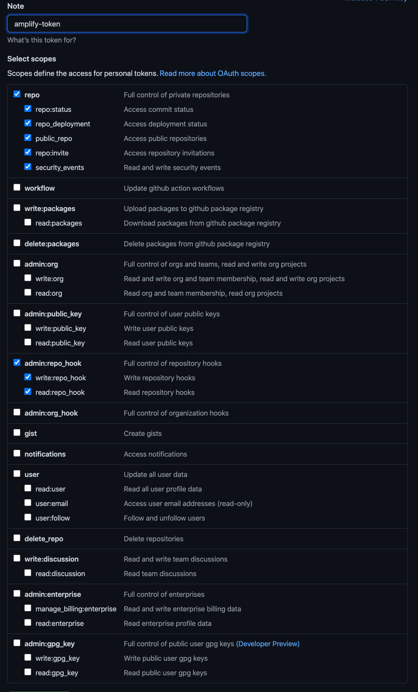

## Hello, AWS Amplify!

Hi, I'm Jae Wook Kim. Today's topic is hosting a Jekyll site with [AWS Amplify](https://aws.amazon.com/amplify/?nc=sn&loc=0).

> This post is written for those who have at least some hands-on experience creating cloud resources via CLI.

This blog is a static site built on [Jekyll](https://jekyllrb.com/) and currently hosted on GitHub Pages. In this post, we'll walk through deploying it to AWS Amplify instead.

Before we begin, make sure you have the following ready:
- AWS CLI configured
- A GitHub account with a Jekyll codebase
  - An OAuthToken is required so Amplify can access your repository.

**Note:** This guide creates **billable** AWS resources. If you're just following along for learning purposes, make sure to delete the resources afterwards. You can always recreate them using the same template.

---

### Creating a GitHub OAuth Token

A GitHub OAuthToken is required during the deployment process.

When Amplify is set up, it creates a Deploy Key on GitHub to inherit the necessary permissions for deployment. To create that Deploy Key, a Personal Access Token is needed.

To create a [Personal Access Token](https://github.com/settings/tokens): log in to GitHub, then click the link or navigate via your profile icon in the top right → Settings → Developer Settings → Personal Access Tokens → Generate New Token. Add a note and grant the permissions shown in the image below.

> The generated token is only shown **once** — make sure to save it! If you missed it, delete the token and generate a new one.

{: width="100%" height="100%"}
{: width="100%" height="100%"}

---

### Deploying AWS Resources

Copy the YAML file below, save it locally as `amplify_infra.yaml`, and deploy it via CLI.
You can monitor the entire deployment process via CLI or through the [AWS Console](https://console.aws.amazon.com/cloudformation/home).

The [CloudFormation](https://docs.aws.amazon.com/AWSCloudFormation/latest/UserGuide/AWS_Amplify.html) template creates 3 resources:
- **IAM Role** (no charge)
  - A service role attached to the Amplify app.
- **Amplify App** (billable)
  - Contains all Amplify configuration. See the CloudFormation docs for details.
  - The `BuildSpec` section defines the build order:
    - Pre-build: Install dependencies listed in Gemfile
    - Build: Build the Jekyll site
    - Artifacts: Output directory after build
    - Cache: Caches the pre-build/build steps to reduce build time (and billing)
- **Amplify Branch** (no charge)
  - Configures which GitHub branch to pull from. Doesn't have to be `main` — multi-branch setups are supported.

```bash
# Deploy CloudFormation stack (~3-5 minutes)
aws cloudformation deploy \
  --stack-name deploy \
  --template-file ./amplify_infra.yaml \
  --capabilities CAPABILITY_NAMED_IAM \
  --parameter-overrides \
    GithubOAuthToken=YOUR_GITHUB_TOKEN \
    GithubURL=YOUR_GITHUB_URL
```

{: width="100%" height="100%"}

<a href="/aws_infra/amplify_infra.yaml" download="amplify_infra.yaml" class="download-btn">⬇ Download amplify_infra.yaml</a>

```yaml
# Required YAML file — save as amplify_infra.yaml
AWSTemplateFormatVersion: 2010-09-09

Parameters:
  GithubOAuthToken:
    Type: String
    Description: Provide Github OAuth Token
    NoEcho: true
  GithubURL:
    Type: String
    Description: Provide Github URL

Resources:
  AmplifyRole:
      Type: AWS::IAM::Role
      Properties:
      AssumeRolePolicyDocument:
          Version: 2012-10-17
          Statement:
          - Effect: Allow
              Principal:
              Service:
                  - amplify.amazonaws.com
              Action:
              - sts:AssumeRole
      Policies:
          - PolicyName: Amplify
          PolicyDocument:
              Version: 2012-10-17
              Statement:
              - Effect: Allow
                  Action: "amplify:*"
                  Resource: "*"
  AmplifyApp:
      Type: "AWS::Amplify::App"
      Properties:
      Name: Blog
      Repository: !REF GithubURL
      AccessToken: !REF GithubOAuthToken
      BuildSpec: |-
          version: 0.1
          frontend:
          phases:
              preBuild:
              commands:
                  - bundle config set --local path 'vendor/bundle' && bundle install
              build:
              commands:
                  - JEKYLL_ENV=production bundle exec jekyll build
          artifacts:
              baseDirectory: _site
              files:
              - '**/*'
          cache:
              paths:
              - 'vendor/**/*'
      Tags:
          - Key: Name
          Value: Jekyll
      IAMServiceRole: !GetAtt AmplifyRole.Arn
  AmplifyBranch:
      Type: AWS::Amplify::Branch
      Properties:
      BranchName: main
      AppId: !GetAtt AmplifyApp.AppId
      Description: main Branch
      EnableAutoBuild: true
      Tags:
          - Key: Name
          Value: Jekyll
Outputs:
  DefaultDomain:
    Value: !GetAtt AmplifyApp.DefaultDomain
```

---

### Accessing the Amplify App

Amplify generates a URL for your deployed app. This URL is exposed as a stack output and can be queried with the CLI below, or found in the AWS Console under the AWS Amplify section.

```bash
aws cloudformation describe-stacks --stack-name deploy --query 'Stacks[*].Outputs[*].OutputValue'
```

---

### Deleting AWS Resources

As mentioned earlier, AWS Amplify is a **billable service**. If this was just for learning, you no longer need it, or you'd simply like to clean up — you can delete all the resources at once with the CLI below.

```bash
## Delete CloudFormation stack
aws cloudformation delete-stack --stack-name deploy
```

---

Thank you for reading to the end! If you have any questions, feel free to reach out via email, LinkedIn, or open a [GitHub issue](https://github.com/iamjaekim/iamjaekim.github.io/issues) — I'll do my best to help!

Have a great day!
