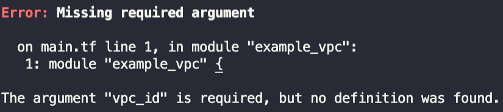

Hello Terraform?

Hello, I'm Jaewook Kim. Today's topic is the Terraform [Module](https://www.terraform.io/docs/configuration/blocks/modules/index.html).

> The `Hello Terraform?` series is written to be easily understood by those who say, "I have at least managed resources in the cloud via CLI," as they move on to the next step.

Terraform Modules refer to groups of Terraform resources we previously discussed—such as resources, outputs, data sources, and locals—packaged together in one place. These building blocks can represent an operating environment you've created, or they can be a collection of various resources bundled to create a larger infrastructure piece. The division of modules is generally structured based on logical planning by the author or software architect. For instance, creating an EC2 instance in AWS requires a VPC and subnets; likewise, you define everything needed for a chunk of resources inside a module. Then, you simply call that module and pass the required parameters to create the entire resource set configured within.

> They can be interpreted similarly to concepts like class, function, def, etc., used in programming.
>
> The key point is that they are version-controlled via a source, reusable, and always reliably produce the defined set of resources.

Terraform modules can be stored in many places. Local directories, code repositories (GitHub, etc.), HTTP(S) URLs, AWS S3, GCS Buckets—all of these are valid module repositories for Terraform. Among them, the easiest one to use is the official [Terraform Registry](https://registry.terraform.io/browse/modules). This registry hosts official and unofficial modules maintained by the open-source community. Most modules are provided as open source on GitHub, meaning you can inspect the code used to build them, check for current bugs, and review the entire version history. I believe properly combining necessary modules from various sources will greatly help in reducing environment setup time and serve as a good learning resource.

Structuring a module starts with a directory. Taking the directory structure below as an example:
```
.
├── ./main.tf
└── ./vpc-module
    ├── ./vpc-module/output.tf
    ├── ./vpc-module/variables.tf
    └── ./vpc-module/vpc.tf
```

`./main.tf` is where you use this vpc module, and it's also the execution directory for Terraform. Local modules use a `relative path` relative to Terraform's execution directory, while remote modules are downloaded from the internet or wherever they are hosted. For both types of modules, running `terraform init` caches them inside the `.terraform` folder. Unless there are changes, running `init` again will just use the cache left in `.terraform`.

When calling a module in the `./main.tf` file, you must pass the *`source` parameter*, and for this module to operate normally, you must provide all the variables defined within the module (`variables.tf`) as parameters. If you don't pass the required parameters, the *`terraform plan` process will output an error message stating that required variable inputs are missing*, looking similar to the one below.

{:class="img-responsive"}

Even when passing variables as parameters to the vpc-module in `./main.tf`, you can certainly pass dynamic variables. If you specify `data`, `locals`, or other `outputs` as variables and pass them as parameters, Terraform will automatically process the variable transformations during execution and use the correct values. **(Pro Tip: Receiving values in Terraform and provider validations are two separate things. For example, if you pass a string or a generic number to a value that strictly requires a CIDR block, it will fail the provider validation, resulting in an API error message. Make sure to verify this so you don't get confused!)**

One interesting aspect of modules is that inside a local module you are writing, you can call both remote and local modules to create nested setups. Doing this might make the state file a bit more complex, but the code becomes much cleaner and easier to read. Therefore, mixing and matching multiple modules as needed to write IaC tailored to your development/operations environment will make writing Terraform much more enjoyable.

Thank you for reading to the end. If you have any questions, feel free to contact me via email, LinkedIn messages, or open a [GitHub Issue](https://github.com/iamjaekim/iamjaekim.github.io/issues), and I will answer to the best of my knowledge!

Have a great day!
