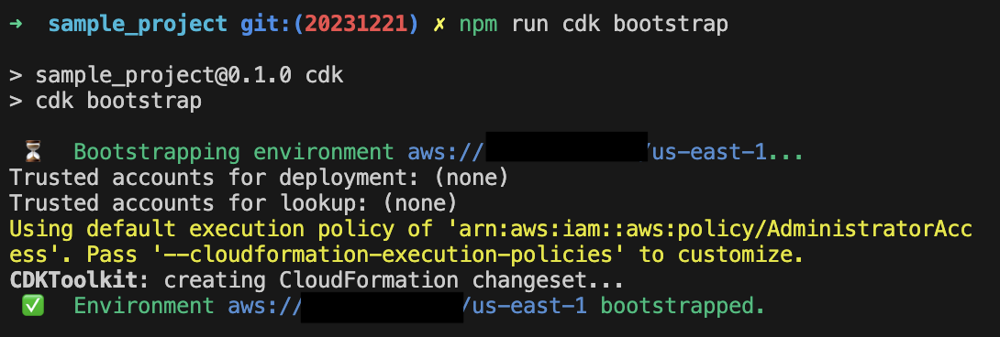
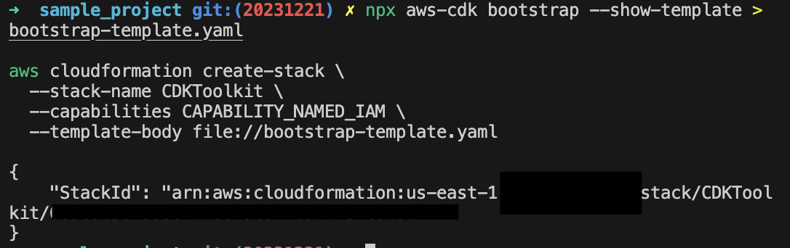

Hello, AWS CDK?

Hello, I'm Jae Wook Kim. Today's topic is about Region and Account Bootstrapping in [CDK](https://docs.aws.amazon.com/cdk/latest/guide/home.html), another resource provisioning tool from AWS.

This post is written so that you can follow along even if you haven't read the previous [Intro]() and [Getting Started]() posts. Also, please be aware that since this involves deploying cloud resources directly to AWS (like S3 buckets, IAM, etc.), it requires permissions in your AWS account and may incur **charges**.

## CDK Bootstrap
The [CDK Bootstrap](https://docs.aws.amazon.com/cdk/v2/guide/bootstrapping.html) (pronounced: bootstrap) process is an absolutely essential step before deploying a CDK application, and it only needs to be done once per region per account. For example, if you want to use the `us-east-1` and `us-west-2` regions, you must do it twice—once for each region.

The key point of this process is the deployment of the `CDKToolKit` CloudFormation stack. This stack deploys permissions and other resources (IAM Roles, S3 buckets, etc.) necessary for deploying CDK applications into that AWS account. You can view the CloudFormation related to this toolkit, and it is designed so that permissions can be added or removed.

## How to bootstrap my aws account? 
There are several ways to perform bootstrapping. In this section, I will introduce two methods: using the `cdk bootstrap` command, which is the simplest way, and directly deploying the CloudFormation template generated by the `cdk cli`. Before using either method, installing the `aws cli` and `cdk cli` tools is mandatory, and you can only proceed to the next step after logging into your account via `aws configure`.

### running cdk bootstrap cli
This method is quite intuitive and is the easiest command to apply the bootstrapping process. You can implement customizations using [various CLI options and parameters](https://docs.aws.amazon.com/cdk/v2/guide/bootstrapping.html#bootstrapping-customizing).
```bash
(npm run) cdk bootstrap aws://ACCOUNTNUMBER/REGION 
```  
Or
```bash
# Need to navigate to the directory where the cdk.json file is located
# Use the project initialized in the Getting Started post
cd sample_project 
(npm run) cdk bootstrap
```
If you run that command, you can confirm that the toolkit has been deployed at the end of a series of processes shown in the terminal.

Example output: 


### running aws cloudformation cli command
If the above method is difficult, you can also create the bootstrap template via the `cdk bootstrap` command and then directly deploy it to the region and account you want to use. The bootstrap-template.yaml file extracted in this step is a CloudFormation template file, and you can directly modify necessary parts.

```bash
npx aws-cdk bootstrap --show-template > bootstrap-template.yaml 

aws cloudformation create-stack \
  --stack-name CDKToolkit \
  --capabilities CAPABILITY_NAMED_IAM \
  --template-body file://bootstrap-template.yaml
```

Example output: 


Congratulations! If you have completed bootstrapping using one of the two methods, you are now in a state where you can deploy your CDK application to your account. I will be back in the next part with how to create resources.

Thank you for reading to the very end today as well. If you have any questions, feel free to contact me via email, LinkedIn messages, or open a [GitHub Issue](https://github.com/iamjaekim/iamjaekim.github.io/issues), and I will answer to the best of my knowledge!

Have a great day!
