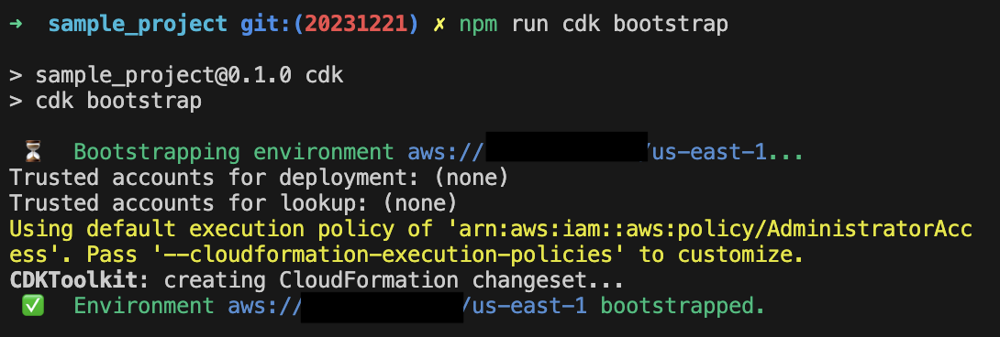
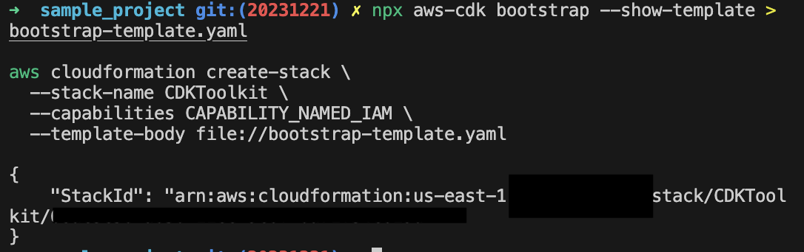

안녕, AWS CDK?

안녕하세요, 김재욱입니다. 오늘의 주제는 AWS의 또 다른 리소스 프로비저닝 툴인 [CDK](https://docs.aws.amazon.com/cdk/latest/guide/home.html)의 리전과 계정 Bootstrapping에 대해 알아보려고 합니다.

이번 글은 종전의 [인트로]()와 [시작하기]()을 보시지 않으셔도 따라 할 수 있는 글 입니다. 또한 AWS로 직접적인 클라우드 리소스(S3버킷, IAM 등) 배포를 하는 과정이 포함됨으로, AWS 계정에 권한과 **과금**이 될 수 있다는 것을 알아두시길 바랍니다. 

## CDK Bootstrap
[CDK Bootstrap](https://docs.aws.amazon.com/cdk/v2/guide/bootstrapping.html) (발음: 부트스트랩/붓스트랩)과정은 CDK 어플리케이션을 배포하기전 꼭 필수적인 단계이며, 리전별 계정당 한번만 하면 되는 과정입니다. 가령 쓰고싶은 리전이 `us-east-1`과 `us-west-2`이면, 리전당 한번씩, 두번 해주셔야 합니다. 

이 과정의 중요 포인트는, `CDKToolKit` 클라우드포메이션 스택의 배포인데, 이 스택은, CDK 어플리케이션을 배포하기 위한 권한들과 여타 리소스들이 (IAM Role, S3 bucket 등) 해당 AWS 계정에 배포가 되어집니다. 이 툴킷관련 클라우드포메이션 역시 볼수 있으며, 권한 추가 및 삭제가 가능하게끔 되어있습니다. 

## How to bootstrap my aws account? 
부트스트랩을 하는 방법엔 여러가지가 있습니다. 이번 섹션에선 가장 간단한 방법인 `cdk bootstrap`를 통한 과정과  `cdk cli`가 만들어주는 클라우드포메이션을 직접 배포하는 두 방법을 소개하려합니다. 두 방법을 사용 전, `aws cli`툴과 `cdk cli`툴 설치는 필수 단계이고, `aws configure`를 통한 계정 로그인 역시 마친 후에 다음으로 넘어가실수 있습니다.  

### running cdk bootstrap cli
이 방법은 꽤나 직관적이고, 가장 쉽게 부트스트랩핑과정을 적용할수 있는 커맨드입니다. [다양한 CLI 옵션과 파라미터로](https://docs.aws.amazon.com/cdk/v2/guide/bootstrapping.html#bootstrapping-customizing) 커스터마이징을 구현해 낼수 있습니다. 
```bash
(npm run) cdk bootstrap aws://ACCOUNTNUMBER/REGION 
```  
또는
```bash
# cdk.json 파일이 있는 디렉토리로 이동 필요
# 시작하기 포스트에서 init한 프로젝트 사용
cd sample_project 
(npm run) cdk bootstrap
```
해당 커맨드를 실행을 하면, 터미널에 보이는 일렬의 과정 끝에 툴킷이 배포된걸 확인 하실 수 있습니다. 

예시 아웃풋: 


### running aws cloudformation cli command
위 방법이 어렵다면, 부트스트랩 템플랫을  `cdk bootstrap` 커맨드를 통해 만든 뒤, 직접적으로 쓰고싶은 리전과 계정에 배포도 가능합니다. 이 단계에서 추출한 bootstrap-template.yaml파일은 클라우드포메이션 템플랫 파일이며, 필요부분에 대해 직접 수정 역시 가능합니다.

```bash
npx aws-cdk bootstrap --show-template > bootstrap-template.yaml 

aws cloudformation create-stack \
  --stack-name CDKToolkit \
  --capabilities CAPABILITY_NAMED_IAM \
  --template-body file://bootstrap-template.yaml
```

예시 아웃풋: 


축하합니다! 두 가지 방법중 하나로 부트스트랩핑을 마치셨다면, CDK 어플리케이션을 사용하시는 계정에 배포 가능한 상태가 되어 있을거고, 다음편엔 리소스 만드는 방법으로 찾아 오겠습니다.

오늘도, 끝까지 읽어주셔서 감사합니다. 질문은 이메일, 링크드인 메시지, [깃헙이슈](https://github.com/iamjaekim/iamjaekim.github.io/issues)로 열어주시면, 아는 한도내에서 답 해드리겠습니다!

오늘도 좋은 하루 되세요!
