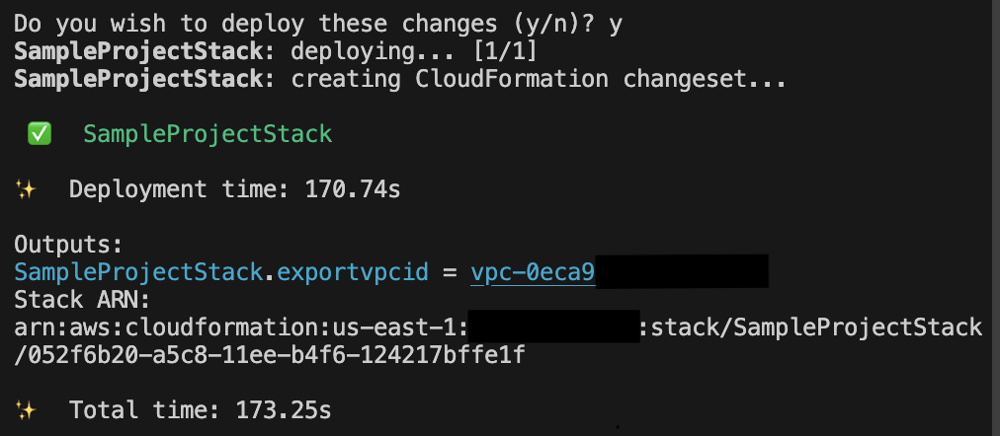

Hello, AWS CDK?

Hello, I'm Jae Wook Kim. Today's topic involves creating our first resource using AWS's alternative resource provisioning tool, [CDK](https://docs.aws.amazon.com/cdk/v2/guide/home.html).  

Just like in the Terraform series, we will be creating a VPC resource this time as well. If you read through and follow along with this post, you will experience creating and deploying a resource to the cloud with AWS CDK.  

## Preparation

If you don't have the sample project created in the previous series, please [follow this post to create it.](#sample-project-setup)

## Exploring the Official CDK Documentation

Next, it's necessary to look at the official CDK documentation for the resource. For our example resource, VPC, you can find it [here](https://docs.aws.amazon.com/cdk/api/v2/docs/aws-cdk-lib.aws_ec2.Vpc.html). Other resources can likewise be found through a simple search or by searching within the linked documentation.  

## [Hands-on] Writing Resource Code

### Creating a VPC with Code

After navigating to the [sample project](https://github.com/iamjaekim/iamjaekim.github.io/tree/main/sample_project), open `lib/sample_project-stack.ts` and start writing code according to the existing TypeScript syntax.

```bash
code path/to/sample_project/lib/sample_project-stack.ts # Open the stack file with vscode
```

After that, if you enter the code below, a VPC named `Sample_Project_DefaultVPC` will be created. If you add [other values](https://docs.aws.amazon.com/cdk/api/v2/docs/aws-cdk-lib.aws_ec2.Vpc.html#construct-props) like `ipAddresses` in addition to the name, the resource will be created with those values.



// lib/sample_project-stack.ts

import { CfnOutput, CfnOutputProps, Stack, StackProps, aws_ec2 as ec2 } from 'aws-cdk-lib';
import { Construct } from 'constructs';

export class SampleProjectStack extends Stack {
  constructor(scope: Construct, id: string, props?: StackProps) {
    super(scope, id, props);

    /**
     * Define vpc properties with ec2.VpcProps type to
     * safe guard the data passing to VPC construct
     */
    const vpc_properties: ec2.VpcProps = {
      vpcName: 'Sample-Project-DefaultVPC'
    }

    /**
     * Creating New VPC with defined properties
     */
    const sample_project_vpc = new ec2.Vpc(this, 'sampleprojectvpc', vpc_properties)

    /**
     * Define cloudfomration export property object 
     */
    const export_vpc_id: CfnOutputProps = {
      exportName: 'sample-project-vpc-id',
      value: sample_project_vpc.vpcId
    }
    /**
     * Create Cloudformation output 
     */
    new CfnOutput(this, 'export-vpc-id', export_vpc_id)
  }
}



### Reviewing the Template Using cdk synth

If you use TypeScript as your main language, you are probably familiar with its type system. The `synth` command can be easily understood as the build process for a TypeScript project. It uses the runtime CDK binary to compile the written resource code and transform it into JSON, which is then outputted as an artifact in the `cdk.out` (default) folder. Simultaneously, it prints out the result in YAML format to the terminal. If you add the optional `--json` parameter, it will also print in JSON format in the terminal.

```bash
cdk synth --json || npm run cdk synth -- --json
```

## ***But wait, there's more.***

### Deploying Using cdk deploy

Infrastructure written as code does absolutely nothing until the deployment process. Let's try deploying it now.

We plan to slowly look at CI/CD, which most of you have probably heard of, in another chapter. Today, we'll practice the direct deployment process using the `cdk deploy` command. In fact, all you have to do is use the `cdk deploy` command, and all other processes will be handled automatically.

Before the deployment process begins, you will be asked this question: `Do you wish to deploy these changes (y/n)?` The point of this question is whether you really want to perform the deployment (i.e., make changes to the infrastructure), and it serves as a warning since the deployment process could involve deleting and recreating resources. You can bypass this question by appending the `--require-approval never` parameter, which will allow the deployment to proceed without asking anymore.

Once a series of steps begins printing in the terminal, the deployment process has started. After everything is finished, with a visual notification checkmark indicating completion, you can go to the CloudFormation console to see the added VPC.

```bash
cdk deploy || npm run cdk deploy
```



Congratulations. Using CDK, you have successfully created and deployed your first resource. I will return in the next part with an example of modifying a resource.

Thank you for reading to the very end today as well. Great job, and well done.
If you have any questions, feel free to contact me via email, LinkedIn messages, or open a [GitHub Issue](https://github.com/iamjaekim/iamjaekim.github.io/issues), and I will answer to the best of my knowledge!

Have a great day!
