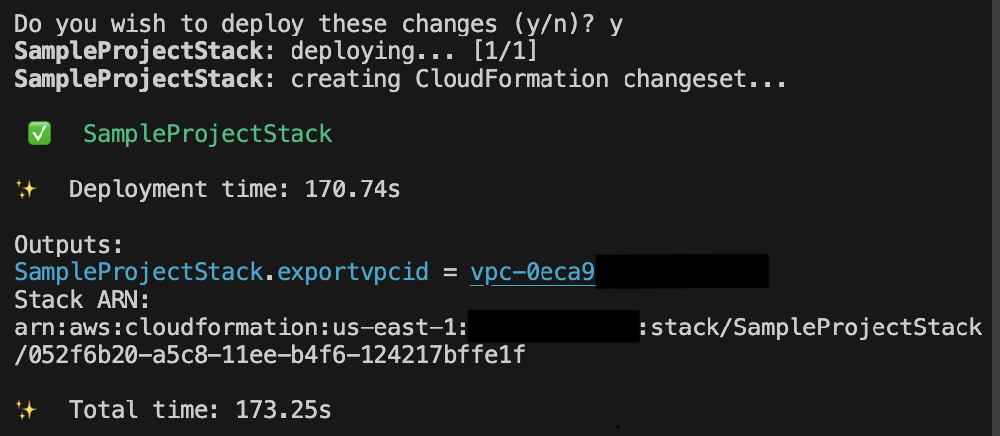

안녕, AWS CDK?

안녕하세요, 김재욱입니다. 오늘의 주제는 AWS의 또 다른 리소스 프로비저닝 툴인 [CDK](https://docs.aws.amazon.com/cdk/latest/guide/home.html)를 사용하여 첫번째 리소스를 만들어 보려합니다.  

테라폼 시리즈때와 마찬가지로, 이번에도 VPC 리소스를 만들어 보며, 이 글을 다 읽고 따라하신다면, aws cdk로 클라우드에 리소스를 만들고 배포까지 해보는 경험하게 될 예정입니다.  

## 준비

지난 시리즈에서 만들었던 샘플 프로젝트가 없다면 [이 글을 따라 만들어 주세요.](https://iamjaekim.github.io/cdk-basics-typescript/#sample_project)

## CDK 공식 문서 둘러보기

그 다음으로는, 리소스에 대한 CDK 공식 문서를 살펴볼 필요가 있습니다. 우리의 예시 리소스인 VPC같은 경우 [여기](https://docs.aws.amazon.com/cdk/api/v2/docs/aws-cdk-lib.aws_ec2.Vpc.html)에서 찾아보실수 있으며, 다른 리소스들 역시, 간단한 검색 또는 링크된 문서에서 검색하여 보시면 됩니다.  

## [실습] 리소스 코드 작성해보기

### 코드로 VPC 만들어보기

[샘플 프로젝트](https://github.com/iamjaekim/iamjaekim.github.io/tree/b4a4740773e27c4613e6262eef24c9de3f2eaecd/sample_project)로 간뒤, `lib/sample_project-stack.ts`를 여신 뒤, 기존 타입스크립트 문법대로 코드 작성을 시작 해 나가면 됩니다.

```bash
code path/to/sample_project/lib/sample_project-stack.ts # vscode로 스택 파일 열기
```

그 후, 아래와 같은 코드를 써 넣는다면, 정의된 이름: `Sample_Project_DefaultVPC`으로 vpc가 만들어지게 됩니다. 이름 이외에 `ipAddresses` 등 [다른 값](https://docs.aws.amazon.com/cdk/api/v2/docs/aws-cdk-lib.aws_ec2.Vpc.html#construct-props)을 추가 한다면, 해당 값으로 리소스를 만들수 있게 됩니다.



// lib/sample_project-stack.ts

import { CfnOutput, CfnOutputProps, Stack, StackProps, aws_ec2 as ec2 } from 'aws-cdk-lib';
import { Construct } from 'constructs';

export class SampleProjectStack extends Stack {
  constructor(scope: Construct, id: string, props?: StackProps) {
    super(scope, id, props);

    /**
     * Define vpc properties with ec2.VpcProps type to
     * safe guard the data passing to VPC construct
     */
    const vpc_properties: ec2.VpcProps = {
      vpcName: 'Sample-Project-DefaultVPC'
    }

    /**
     * Creating New VPC with defined properties
     */
    const sample_project_vpc = new ec2.Vpc(this, 'sampleprojectvpc', vpc_properties)

    /**
     * Define cloudfomration export property object 
     */
    const export_vpc_id: CfnOutputProps = {
      exportName: 'sample-project-vpc-id',
      value: sample_project_vpc.vpcId
    }
    /**
     * Create Cloudformation output 
     */
    new CfnOutput(this, 'export-vpc-id', export_vpc_id)
  }
}



### cdk synth 사용하여 템플릿 리뷰

Typescript을 주 언어로 사용 하면 타입 시스템에 익숙하실 겁니다. Synth 커맨드는 타입스트립트 프로젝트의 빌드 과정이라고 생각하면 이해하기 편한데, 런타임 CDK 바이너리를 사용하여, 작성된 리소스 코드를 컴파일하여 JSON으로 변환되는 과정을 거치며, (기본값인) `cdk.out` 폴더에 산출물로서 나와지게 됩니다. 동시에 터미널엔 YAML포맷으로 프린트가 됩니다. 그리고 옵션널 파라미터인 `--json` 을 추가해주게되면, 터미널에도 JSON형식으로 역시 나오게 됩니다.

```bash
cdk synth --json || npm run cdk synth -- --json
```

## ***하지만 여기서 끝이 아닙니다.***

### cdk deploy 사용하여 배포

코드로 작성된 인프라는 배포과정 전까지는 아무것도 하지 않는 코드입니다. 이제 배포를 한번 해보도록 해보겠습니다.

아마 대부분이 들어보신 CI/CD는 다른 챕터에서 차차 봐보도록 할 예정이며, 오늘은 `cdk deploy`커맨드를 사용한 직접 배포 과정을 한번 같이 실습해보도록 하겠습니다. 사실상 해야할건, `cdk deploy` 커맨드를 사용 해주시면 이외 모든과정이 자동적으로 되게 됩니다.

배포 과정 시작 되기 전, 이런 질문을 받게 됩니다. `Do you wish to deploy these changes (y/n)?` 이 질문의 요지는, 진짜 배포를 (aka 인프라스트럭쳐에 변화를) 하길 원하느냐 라는게 포인트이며, 배포에 과정중 리소스 삭제와 재생성이 포함 되어있을 경우가 있을수 있으니 주의를 요한다는 포인트가 있습니다. 해당 질문를 바이패스 하는 파라미터는 `--require-approval never` 를 추가하시면, 더이상 질문 없이 배포를 진행할수 있습니다.

터미널에 일렬의 과정들이 프린트 되기 시작하면, 배포 과정이 시작이 된것이며, 모든 과정이 끝난 뒤엔 끝났다는 체크마크로 비주얼적인 알림과 함께, 클라우드포메이션 콘솔에 가면 추가된 VPC를 보실수 있습니다.

```bash
cdk deploy || npm run cdk deploy
```



축하드립니다. CDK를 사용하여 첫 리소스를 만들고, 배포까지 완료하셨습니다. 다음편엔 리소스를 변경하는 예시와 함께 돌아오도록 하겠습니다.

오늘도, 끝까지 읽어주셔서 감사합니다. 고생 많으셨고, 수고하셨습니다.
질문은 이메일, 링크드인 메시지, [깃헙이슈](https://github.com/iamjaekim/iamjaekim.github.io/issues)로 열어주시면, 아는 한도내에서 답 해드리겠습니다!

오늘도 좋은 하루 되세요!
